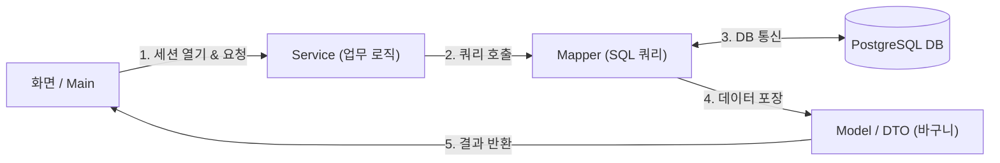

# 🚀 초보자를 위한 마이바티스(MyBatis) 사용 가이드

> **💡 한 줄 요약**  
> 마이바티스는 **자바 코드와 SQL 쿼리를 깔끔하게 연결해 주는 도구**입니다.  
> 복잡한 JDBC 코드(`Connection`, `PreparedStatement`, `ResultSet`)를 직접 작성할 필요 없이 어노테이션이나 XML로 간편하게 DB 작업을 할 수 있습니다.

---

## 🧭 1. 전체 구조 한눈에 보기

우리 프로젝트는 **역할에 따라 4단계로 분리**되어 있습니다.



| 구성 요소 | 위치 (패키지) | 역할 | 비유 |
| :--- | :--- | :--- | :--- |
| **Model (DTO)** | `com.team.orderapp.model` | DB 데이터를 자바에 담아둘 바구니 | **음식을 담는 접시** |
| **Mapper** | `com.team.orderapp.mapper` | 실제 SQL 쿼리를 작성하는 인터페이스 | **주방의 요리 레시피 (주문서)** |
| **Service** | `com.team.orderapp.service` | 비즈니스 로직 및 매퍼 호출 헬퍼 | **웨이터 (주문 접수 및 서빙)** |
| **Config** | `src/main/resources/mybatis-config.xml` | 마이바티스 환경설정 및 매퍼 등록소 | **식당 운영 매뉴얼** |

---

## 🛠️ 2. DB 작업별(CRUD) 작성법 & 사용법

### 1) Mapper 인터페이스에서 SQL 작성하기
쿼리를 추가하고 싶을 때는 `src/main/java/com/team/orderapp/mapper/` 안의 매퍼 파일에 메서드를 만듭니다.

```java
package com.team.orderapp.mapper;

import com.team.orderapp.model.Product;
import org.apache.ibatis.annotations.*;
import java.math.BigDecimal;
import java.util.List;

public interface ProductMapper {

    // 🔍 [SELECT] 전체 목록 조회
    @Select("SELECT * FROM product ORDER BY product_id")
    List<Product> GetAllProducts();

    // 🔍 [SELECT] ID로 특정 단건 조회 (파라미터는 #{id}로 전달)
    @Select("SELECT * FROM product WHERE product_id = #{id}")
    Product FindById(@Param("id") Long id);

    // ➕ [INSERT] 신규 데이터 등록
    @Insert("INSERT INTO product (product_code, category_id, product_name, price, stock_quantity) " +
            "VALUES (#{productCode}, #{categoryId}, #{productName}, #{price}, #{stockQuantity})")
    void InsertProduct(Product product);

    // ✏️ [UPDATE] 데이터 수정
    @Update("UPDATE product SET price = #{price} WHERE product_id = #{id}")
    void UpdatePrice(@Param("id") Long id, @Param("price") BigDecimal price);

    // ❌ [DELETE] 데이터 삭제
    @Delete("DELETE FROM product WHERE product_id = #{id}")
    void DeleteProduct(@Param("id") Long id);
}
```

---

### 2) 서비스(Service) 또는 메인에서 실제 호출하기
실제 쿼리를 실행하려면 **`SqlSession`을 열어서 매퍼를 꺼내 호출**합니다.

```java
import com.team.orderapp.common.MyBatisFactory;
import com.team.orderapp.mapper.ProductMapper;
import com.team.orderapp.model.Product;
import org.apache.ibatis.session.SqlSession;
import java.util.List;

public class Example {
    public void DoDbWork() {
        // 1. 세션 열기 (DB와 연결되는 통로 생성)
        try (SqlSession session = MyBatisFactory.GetFactory().openSession()) {
            
            // 2. 마이바티스에게 매퍼 인터페이스 꺼내달라고 요청
            ProductMapper mapper = session.getMapper(ProductMapper.class);

            // ----------------------------------------------------
            // A. 데이터 조회 (SELECT)
            // ----------------------------------------------------
            List<Product> productList = mapper.GetAllProducts();
            for (Product p : productList) {
                System.out.println(p.GetProductName() + " : " + p.GetPrice() + "원");
            }

            // ----------------------------------------------------
            // B. 데이터 등록 / 수정 / 삭제 (INSERT, UPDATE, DELETE)
            // ----------------------------------------------------
            Product newProduct = new Product();
            newProduct.SetProductCode("PROD-999");
            newProduct.SetCategoryId(1L);
            newProduct.SetProductName("게이밍 키보드");
            newProduct.SetPrice(new BigDecimal("89000"));
            newProduct.SetStockQuantity(50);

            mapper.InsertProduct(newProduct);

            // ⚠️ 가장 중요!! 데이터 변경 후에는 반드시 도장을 찍어야 영구 저장됩니다!
            session.commit(); 
            
        } catch (Exception e) {
            System.out.println("DB 처리 중 오류: " + e.getMessage());
        }
    }
}
```

---

## 🛑 3. 현재 메인에서 자동 등록되는 테스트 상품 끄는 법

프로그램 실행 시마다 콘솔에 "텀블러/마우스가 등록되었어!"라고 나오는 코드는 **[`src/main/java/com/team/orderapp/app/Main.java`](file:///C:/Users/user/Documents/GitHub/DTS_miniproject_01/src/main/java/com/team/orderapp/app/Main.java)** 에 있습니다.

### 끄는 방법 (선택 1) : INSERT 코드만 주석 처리
`Main.java`의 **30~34번 라인** 앞부분에 `//`를 붙여주세요.
```java
// ProductService.AddNewProduct(mapper, "스테인리스 텀블러", 15000);
// ProductService.AddNewProduct(mapper, "무선 마우스", 25000);
// session.commit();
```
> 이렇게 하면 더 이상 DB에 새 상품이 추가되지 않고, 기존에 저장된 목록만 SELECT하여 보여줍니다.

### 끄는 방법 (선택 2) : 테스트 실행 자체를 끄기
`Main.java`의 **16번 라인**을 주석 처리해주세요.
```java
public static void main(String[] InArgs) {
    // RunOrderSystem();  <-- 앞에 // 붙이기
    BootstrapApplication(InArgs);
}
```
> 테스트 출력이 완전히 꺼지고 바로 원래 메인 메뉴 화면으로 진입합니다.

---

## 📋 4. 새 테이블(User, Order 등) 추가 시 4단계 공식 (복붙용 치트키)

앞으로 7개 테이블 중 나머지 6개 테이블을 추가할 때 **아래 4단계만 그대로 따라 하시면 됩니다!**

### Step 1. 모델 바구니 만들기 (`model/Xxx.java`)
* DB 테이블 컬럼에 맞춰 필드 선언 (기본 생성자 + Getter/Setter)
* `user_id` ➔ `private Long userId;` (카멜케이스로 작성)

### Step 2. 매퍼 인터페이스 만들기 (`mapper/XxxMapper.java`)
* 필요한 쿼리 작성 (`@Select`, `@Insert`, `@Update`, `@Delete`)
* 파라미터가 2개 이상이면 `@Param("이름")` 꼭 붙이기!

### Step 3. 마이바티스 설정에 등록하기 (`mybatis-config.xml`)
* `src/main/resources/mybatis-config.xml`의 `<mappers>` 태그 안에 한 줄 추가:
```xml
<mappers>
    <mapper class="com.team.orderapp.mapper.ProductMapper"/>
    <!-- 새로 만든 매퍼를 아래에 등록 -->
    <mapper class="com.team.orderapp.mapper.UserMapper"/> 
</mappers>
```

### Step 4. 세션 열고 호출하기
```java
try (SqlSession session = MyBatisFactory.GetFactory().openSession()) {
    UserMapper mapper = session.getMapper(UserMapper.class);
    // 원하는 매퍼 메서드 호출
    session.commit(); // 변경사항 있을 때만
}
```

---

## ⚠️ 5. 초보자가 가장 많이 하는 실수 TOP 3

1. **`session.commit()` 누락**
   - 증상: INSERT나 UPDATE를 했는데 콘솔에는 에러가 안 뜨는데 DBeaver에서 보면 데이터가 안 들어가 있음!
   - 해결: 데이터가 변경되는 작업 뒤에는 반드시 `session.commit();` 호출!
2. **`mybatis-config.xml`에 매퍼 등록 누락**
   - 증상: `Type interface ... is not known to the MapperRegistry` 에러 발생!
   - 해결: 새 매퍼를 만들면 무조건 `mybatis-config.xml`의 `<mappers>` 안에 추가해야 마이바티스가 인식합니다.
3. **단수/복수 테이블 이름 헷갈림**
   - 증상: `relation "xxx" does not exist`
   - 해결: DB에 테이블을 `orders`로 만들었는지 `orders_item`인지 `product`인지 DBeaver 테이블명과 똑같이 적어야 합니다.
