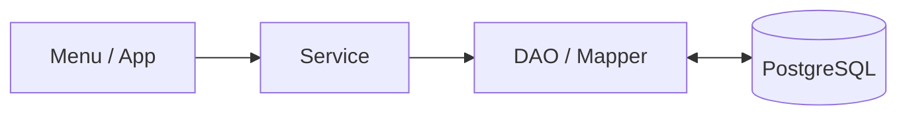

# 🛒 TERMINAL MARKET

<p align="center">
  <b>Java Console 기반 상품 · 주문 · 재고 관리 시스템</b>
</p>

<p align="center">
  
</p>

<p align="center">
  Java, MyBatis, PostgreSQL을 활용하여<br>
  상품 조회부터 주문, 재고, 시리얼, 반품까지 구현하는 팀 프로젝트입니다.
</p>


---

## 📌 Project Overview

| 항목 | 내용 |
| :--- | :--- |
| **프로젝트명** | TERMINAL MARKET |
| **개발 기간** | 2026.09 ~ 진행 중 |
| **개발 인원** | 4명 |
| **개발 형태** | Java Console Application |
| **주요 목적** | Java + MyBatis + PostgreSQL 기반 CRUD 및 주문 트랜잭션 구현 |
| **대상 플랫폼** | PC Console |

### 프로젝트 목표

단순 CRUD 구현을 넘어 상품, 회원, 장바구니, 주문, 재고가 서로 연결되는 구조를 직접 설계하고 구현하는 것을 목표로 합니다.

```text
사용자
  ↓
Menu
  ↓
Service
  ↓
DAO / MyBatis
  ↓
PostgreSQL
```

---

# 🛠 Tech Stack

## Language


## Database


## Backend / DB Access


## Build / IDE


## Collaboration


---

# ✨ Main Features

## 👤 사용자 / 인증

- 회원가입
- 로그인 / 로그아웃
- 회원 / 관리자 권한 분리
- 회원정보 조회 및 수정
- 비회원 주문 지원

## 📦 상품

- 상품 등록 / 수정 / 삭제
- 상품 전체 조회
- 카테고리 / 가격 조건 조회
- 상품 판매 상태 관리
- 계층형 카테고리 관리

## 🛒 장바구니

- 상품 추가
- 수량 변경
- 상품 삭제
- 장바구니 전체 비우기
- 회원 / 비회원 주문 연결

## 📋 주문

- 회원 주문
- 비회원 주문
- 주문번호 생성
- 주문 상세 조회
- 주문 전체 반품
- 주문 트랜잭션 처리

## 📊 재고 / 시리얼

- 상품 재고 입고 / 조정
- 재고 변경 이력 관리
- 시리얼 번호 등록
- 시리얼 상품 판매 상태 관리
- 주문 및 반품 시 재고 자동 반영

## 📈 관리자

- 회원 관리
- 상품 / 카테고리 관리
- 주문 / 반품 관리
- 매출 / 상품 통계
- CSV Import / Export

---

# 🏗 Architecture

프로젝트는 역할을 분리하기 위해 다음 구조를 사용합니다.



| Layer | 역할 |
| :--- | :--- |
| **Menu / App** | 사용자 입력 및 콘솔 출력 |
| **Service** | 비즈니스 로직, 검증, 트랜잭션 |
| **DAO / Mapper** | MyBatis를 이용한 SQL 실행 |
| **Model** | DB 데이터를 Java 객체로 표현 |
| **Database** | 데이터 영구 저장 |

---

# 🗄 Database

현재 프로젝트는 총 **9개의 주요 테이블**로 구성되어 있습니다.

| 테이블 | 역할 |
| :--- | :--- |
| `app_user` | 로그인 계정 및 권한 |
| `customer` | 일반 회원 정보 |
| `category` | 상품 카테고리 |
| `product` | 상품 정보 |
| `product_unit` | 시리얼 관리 개별 상품 |
| `orders` | 주문 |
| `order_item` | 주문 상품 |
| `order_item_unit` | 주문 상품 ↔ 시리얼 연결 |
| `stock_adjustment` | 재고 변경 이력 |

### 주요 관계

```text
app_user
   └─ customer

category
   └─ product
        └─ product_unit

orders
   └─ order_item
        └─ order_item_unit

product
   └─ stock_adjustment
```

---

# 📁 Project Structure

```text
src/main/java/com/team/orderapp
│
├─ app
│  ├─ Main.java
│  ├─ GuestMenu.java
│  ├─ MemberMenu.java
│  ├─ AdminMenu.java
│  └─ ProductCommandMenu.java
│
├─ common
│  ├─ DbConnectionFactory.java
│  ├─ ConsoleInput.java
│  ├─ BusinessException.java
│  └─ OrderNoGenerator.java
│
├─ auth
│  ├─ AppUser.java
│  ├─ LoginSession.java
│  ├─ AuthService.java
│  └─ AppUserDao.java
│
├─ customer
│  ├─ Customer.java
│  ├─ CustomerService.java
│  └─ CustomerDao.java
│
├─ cart
│  ├─ Cart.java
│  ├─ CartItem.java
│  └─ CartService.java
│
├─ product
│  ├─ Product.java
│  ├─ Category.java
│  ├─ ProductUnit.java
│  ├─ ProductService.java
│  └─ ProductDao.java
│
├─ stock
│  ├─ StockAdjustment.java
│  ├─ StockService.java
│  └─ StockAdjustmentDao.java
│
├─ order
│  ├─ Order.java
│  ├─ OrderItem.java
│  ├─ OrderItemUnit.java
│  ├─ OrderCommandService.java
│  └─ OrderQueryService.java
│
├─ report
│  └─ ReportService.java
│
└─ export
   ├─ CsvExporter.java
   └─ CsvImporter.java
```

> 실제 구현 진행에 따라 일부 클래스 및 패키지 구조는 변경될 수 있습니다.

---

# 🚀 Installation & Run

## 1. Repository Clone

```bash
git clone <REPOSITORY_URL>
```

```bash
cd DTS_miniproject_01
```

---

## 2. PostgreSQL Database 준비

PostgreSQL에서 프로젝트용 데이터베이스를 생성합니다.

프로젝트에서 제공하는 SQL을 순서대로 실행합니다.

```text
1. Schema SQL
2. Category Seed SQL
3. Test / Dummy Data SQL
```

---

## 3. DB 접속 설정

```text
src/main/resources/config/db.properties
```

예시:

```properties
db.driver=org.postgresql.Driver
db.url=jdbc:postgresql://localhost:5432/DB_NAME
db.username=USERNAME
db.password=PASSWORD
```

> ⚠️ 실제 DB 계정 정보가 들어있는 파일은 공개 GitHub Repository에 업로드하지 않는 것을 권장합니다.

---

## 4. Application 실행

IntelliJ IDEA에서:

```text
com.team.orderapp.app.Main
```

클래스를 실행합니다.

또는 Gradle 설정에 따라 CLI로 실행할 수 있습니다.

---

# 👥 Team

| 이름 | 담당 |
| :--- | :--- |
| **백종민** | 상품 / 카테고리, 재고, 시리얼, 상품 CSV, DB 구조 |
| **이태은** | 회원정보, 회원가입 입력 및 검증 |
| **김상진** | 로그인 / 인증 / 세션, 주문 생성, 반품, 트랜잭션 |
| **박형준** | 메인 메뉴, 상품 조회, 장바구니, 주문 조회, 통계 |

---

# 👥 Team

<table>
  <tr>
    <td rowspan="5" align="center" valign="middle">
      
    </td>
    <th align="center">이름</th>
    <th align="center">담당</th>
  </tr>
  <tr>
    <td align="center"><b>백종민</b></td>
    <td>상품 / 카테고리, 재고, 시리얼, 상품 CSV, DB 구조</td>
  </tr>

  <tr>
    <td align="center"><b>이태은</b></td>
    <td>회원정보, 회원가입 입력 및 검증</td>
  </tr>

  <tr>
    <td align="center"><b>김상진</b></td>
    <td>로그인 / 인증 / 세션, 주문 생성, 반품, 트랜잭션</td>
  </tr>

  <tr>
    <td align="center"><b>박형준</b></td>
    <td>메인 메뉴, 상품 조회, 장바구니, 주문 조회, 통계</td>
  </tr>
</table>

---

# 🤝 Collaboration

프로젝트 협업에는 다음 도구를 사용합니다.

| 도구 | 용도 |
| :--- | :--- |
| **GitHub** | 소스코드 버전 관리 / Pull Request |
| **Git** | Branch / Merge 관리 |
| **Figma** | UI 및 콘솔 화면 흐름 설계 |
| **Google Drive** | 기획서 / 설계 문서 / 공유 자료 관리 |

---

# 🌿 Branch Convention

기능별 브랜치를 생성하여 작업합니다.

```text
main
│
├─ feature/product
├─ feature/order
├─ feature/customer
├─ feature/cart
└─ feature/report
```

기본 협업 흐름:

```text
Branch 생성
    ↓
기능 구현
    ↓
Commit
    ↓
Push
    ↓
Pull Request
    ↓
Review
    ↓
Merge
```

---

# 📝 Commit Convention

| Prefix | 설명 |
| :--- | :--- |
| `feat` | 새로운 기능 구현 |
| `fix` | 버그 수정 |
| `refactor` | 코드 구조 개선 |
| `docs` | 문서 수정 |
| `test` | 테스트 코드 |
| `chore` | 설정 및 기타 작업 |

### Example

```text
feat: 상품 등록 기능 구현
fix: 상품 시리얼 조회 오류 수정
refactor: ProductService 검증 로직 분리
docs: README 프로젝트 설명 추가
```

---

# 🔀 Pull Request Guide

PR 작성 시 다음 내용을 포함합니다.

```markdown
## 작업 내용
- 구현한 기능 설명

## 변경 사항
- 주요 코드 변경 내용

## 테스트
- 테스트 방법 및 결과

## 참고
- 리뷰 시 확인이 필요한 내용
```

가급적 자신의 기능 브랜치에서 작업 후 PR을 통해 병합합니다.

---

# 💡 Core Design Rules

### 상품 등록과 재고 관리 분리

```text
상품 등록
→ 기본 재고 0

재고 입고
→ Stock 기능에서 처리
```

### 일반 상품 / 시리얼 상품 분리

```text
requires_serial = false
→ 수량 기반 재고 관리

requires_serial = true
→ product_unit 기반 개별 시리얼 관리
```

### 주문 트랜잭션

```text
주문 생성
+ 주문상품 생성
+ 재고 차감
+ 시리얼 할당

모두 성공
→ COMMIT

하나라도 실패
→ ROLLBACK
```

### 반품

현재 프로젝트에서는 복잡도를 줄이기 위해 **주문 전체 반품**만 지원합니다.

```text
CONFIRMED
    ↓
RETURNED
```

반품 시 재고와 시리얼 상태를 함께 복구합니다.

---

# ✅ Development Status

- [x] 프로젝트 기본 구조 설계
- [x] PostgreSQL 연결
- [x] MyBatis 연동
- [x] DB Schema 작성
- [x] 카테고리 초기 데이터
- [x] 테스트 데이터 구성
- [x] Product 모델 DB 매핑
- [x] 상품 등록 기본 기능
- [ ] 상품 관리 기능
- [ ] 상품 조회
- [ ] 회원가입 / 로그인
- [ ] 장바구니
- [ ] 주문 / 반품
- [ ] 재고 관리
- [ ] 시리얼 관리
- [ ] 통계
- [ ] CSV
- [ ] 통합 테스트

---

# 📷 Preview

> 프로젝트 구현 완료 후 콘솔 실행 화면 또는 주요 기능 GIF를 추가할 예정입니다.

```text
TERMINAL MARKET

[Guest]
상품 조회 → 장바구니 → 주문

[Member]
로그인 → 상품 조회 → 주문 → 주문 조회 / 반품

[Admin]
상품 → 재고 → 회원 → 주문 → 통계
```

---

## 📎 Repository Checklist

- [ ] Repository Public 설정 확인
- [x] 프로젝트 제목 작성
- [ ] 프로젝트 대표 이미지 추가
- [x] 프로젝트 소개 작성
- [x] 개발 기간 / 인원 작성
- [x] 개발 환경 작성
- [x] 주요 라이브러리 작성
- [x] 설치 및 실행 방법 작성
- [x] 프로젝트 구조 작성
- [x] Commit Convention 작성
- [x] Branch Convention 작성
- [x] PR Guide 작성
- [x] 주요 기능 작성
- [ ] 프로젝트 시연 영상 추가
