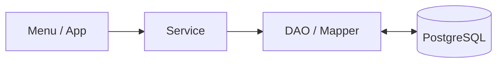

# 🛒 TERMINAL MARKET

<p align="center">
  <b>Java Console 기반 상품 · 주문 · 재고 관리 시스템</b>
</p>

<p align="center">
  
</p>

<p align="center">
  Java, MyBatis, PostgreSQL을 활용하여<br>
  상품 조회부터 주문, 재고, 시리얼, 반품까지 구현하는 팀 프로젝트입니다.
</p>


---

## 📌 Project Overview

| 항목 | 내용 |
| :--- | :--- |
| **프로젝트명** | TERMINAL MARKET |
| **개발 기간** | 2026.09.16 ~ 2026.09.22 (완료) |
| **개발 인원** | 4명 (팀명: TMT) |
| **개발 형태** | Java Console Application |
| **주요 목적** | Java + MyBatis + PostgreSQL 기반 CRUD 및 주문 트랜잭션 구현 |
| **대상 플랫폼** | PC Console |

### 프로젝트 목표

단순 CRUD 구현을 넘어 상품, 회원, 장바구니, 주문, 재고가 서로 연결되는 구조를 직접 설계하고 구현하는 것을 목표로 합니다.

```text
사용자
  ↓
Menu
  ↓
Service
  ↓
DAO / MyBatis
  ↓
PostgreSQL
```

---

# 🛠 Tech Stack

## Language


## Database


## Backend / DB Access


## Build / IDE


## Collaboration


---

# ✨ Main Features

## 👤 사용자 / 인증

- 회원가입 (정규식 이메일 · 비밀번호 · 연락처 유효성 검증)
- SHA-256 Salt 기반 비밀번호 단방향 암호화
- 로그인 / 로그아웃 (LoginSession 싱글톤 인메모리 관리)
- 회원 / 관리자 권한 분리 (RBAC)
- 회원정보 조회 및 수정, 비밀번호 변경 (마이페이지)
- 비회원 주문 및 주문 조회 지원

## 📦 상품

- 상품 등록 / 수정 / 삭제
- 상품 전체 조회 (페이징 콘솔 테이블)
- 계층형 카테고리(Self FK 대분류-소분류) 탐색
- 카테고리 / 가격대 / 키워드 조건 복합 검색
- 상품 상세 조회 및 시리얼 관리 대상(`requires_serial`) 여부 확인
- 상품 판매 상태(`SELLING` / `STOPPED`) 관리

## 🛒 장바구니

- 세션 기반 사용자별 독립 장바구니 식별 및 격리
- 상품 추가 (수량 누적)
- 수량 변경 및 개별 품목 삭제
- 장바구니 전체 비우기
- 장바구니 기반 다중 품목 일괄 주문 연결

## 📋 주문

- 회원 장바구니 일괄 주문
- 비회원 즉시 단품 주문
- 외부 노출용 주문번호 자동 채번 (`OrderNoGenerator`)
- 단일 트랜잭션 주문 결제 (재고 차감 + 시리얼 매핑 + 주문서 생성)
- 주문 내역 상세 및 배정된 고유 시리얼 번호 조회
- 주문 전체 반품 (`CONFIRMED` → `RETURNED` 상태 전이, 재고 및 시리얼 상태 원복)

## 📊 재고 / 시리얼

- 상품 재고 입고 / 수량 조정
- 재고 변경 감사 이력 관리 (`StockAdjustment`: 누가, 언제, 왜, 얼마나)
- 안전재고(`reorder_level`) 기준 재고 부족 / 품절 실시간 모니터링
- 단품별 고유 시리얼 번호 개별 등록 (`product_unit`)
- 시리얼 상품 판매 상태(`AVAILABLE` ↔ `SOLD`) 관리
- 재고 정합성 자동 검사 (`SerialStockConsistency`: DB 재고 = AVAILABLE 시리얼 수)

## 📈 관리자

- 회원 정보 관리
- 상품 및 계층형 카테고리 트리 관리
- 주문 및 반품 통합 관리
- 매출 통계 대시보드 (총 누적 매출, 당일 매출, 베스트셀러 Top 5)
- 대용량 상품 / 시리얼 CSV Import 및 Export

---

# 🏗 Architecture

프로젝트는 역할을 분리하기 위해 다음 구조를 사용합니다.



| Layer | 역할 |
| :--- | :--- |
| **Menu / App** | 사용자 입력 및 콘솔 출력 |
| **Service** | 비즈니스 로직, 검증, 트랜잭션 |
| **DAO / Mapper** | MyBatis를 이용한 SQL 실행 |
| **Model** | DB 데이터를 Java 객체로 표현 |
| **Database** | 데이터 영구 저장 |

---

# 🗄 Database

현재 프로젝트는 총 **9개의 주요 테이블**로 구성되어 있습니다.

| 테이블 | 역할 |
| :--- | :--- |
| `app_user` | 로그인 계정 및 권한 |
| `customer` | 일반 회원 정보 |
| `category` | 상품 카테고리 (계층형 Self FK) |
| `product` | 상품 마스터 정보 |
| `product_unit` | 시리얼 관리 개별 단품 |
| `orders` | 주문 헤더 (회원/비회원) |
| `order_item` | 주문 상세 품목 (스냅샷 단가) |
| `order_item_unit` | 주문 품목 ↔ 시리얼 출고 매핑 이력 |
| `stock_adjustment` | 재고 변경 감사 로그 |

### 주요 관계

```text
app_user
   └─ customer

category (Self FK)
   └─ product
        └─ product_unit

orders
   └─ order_item
        └─ order_item_unit (product_unit 매핑)

product
   └─ stock_adjustment (app_user 처리자 매핑)
```

---

# 📁 Project Structure

```text
src/main/java/com/team/orderapp
│
├─ app
│  ├─ Main.java
│  ├─ GuestMenu.java
│  ├─ MemberMenu.java
│  └─ AdminMenu.java
│
├─ common
│  ├─ DbConnectionFactory.java
│  ├─ ConsoleInput.java
│  ├─ ConsoleUi.java
│  ├─ BusinessException.java
│  └─ OrderNoGenerator.java
│
├─ auth
│  ├─ AppUser.java
│  ├─ UserRole.java
│  ├─ LoginSession.java
│  ├─ LoginMenu.java
│  ├─ SignupMenu.java
│  ├─ AuthService.java
│  ├─ LoginService.java
│  ├─ AppUserDao.java
│  └─ PasswordHasher.java
│
├─ customer
│  ├─ Customer.java
│  ├─ CustomerMenu.java
│  ├─ MyInfoMenu.java
│  ├─ CustomerService.java
│  └─ CustomerDao.java
│
├─ product
│  ├─ Product.java
│  ├─ Category.java
│  ├─ ProductUnit.java
│  ├─ ProductMenu.java
│  ├─ ProductListMenu.java
│  ├─ ProductDetailMenu.java
│  ├─ ProductConditionMenu.java
│  ├─ ProductCommandMenu.java
│  ├─ CategoryMenu.java
│  ├─ ProductService.java
│  ├─ CategoryService.java
│  ├─ ProductDao.java
│  ├─ ProductUnitDao.java
│  └─ CategoryDao.java
│
├─ cart
│  ├─ Cart.java
│  ├─ CartItem.java
│  ├─ CartMenu.java
│  ├─ CartService.java
│  └─ CartDao.java
│
├─ order
│  ├─ model
│  │  ├─ Order.java
│  │  ├─ OrderItem.java
│  │  ├─ OrderItemUnit.java
│  │  └─ OrderStatus.java
│  │
│  ├─ command
│  │  ├─ OrderCommandMenu.java
│  │  ├─ OrderCommandService.java
│  │  └─ OrderCommandDao.java
│  │
│  └─ query
│     ├─ OrderQueryMenu.java
│     ├─ OrderAdminMenu.java
│     ├─ OrderQueryService.java
│     ├─ OrderQueryDao.java
│     ├─ OrderDetailView.java
│     ├─ OrderItemDetailView.java
│     └─ OrderSummaryView.java
│
├─ stock
│  ├─ StockAdjustment.java
│  ├─ StockAdjustmentHistory.java
│  ├─ SerialStockConsistency.java
│  ├─ StockMenu.java
│  ├─ StockService.java
│  └─ StockAdjustmentDao.java
│
├─ report
│  ├─ AdminDashboardStat.java
│  ├─ DailySalesStat.java
│  ├─ ProductSalesStat.java
│  ├─ ReportMenu.java
│  ├─ ReportService.java
│  └─ ReportDao.java
│
└─ export
   ├─ CsvExporter.java
   ├─ CsvExportService.java
   ├─ CsvImporter.java
   ├─ ProductCsvMenu.java
   ├─ ProductCsvService.java
   └─ SerialCsvRow.java
```

---

# 🚀 Installation & Run

## 1. Repository Clone

```bash
git clone <REPOSITORY_URL>
```

```bash
cd DTS_miniproject_01
```

---

## 2. PostgreSQL Database 준비

PostgreSQL에서 프로젝트용 데이터베이스를 생성합니다.

프로젝트에서 제공하는 SQL을 순서대로 실행합니다.

```text
1. Schema SQL (sql/schema.sql)
2. Category Seed SQL (sql/seed.sql)
```

---

## 3. DB 접속 설정

```text
config/db.properties
```

예시:

```properties
db.driver=org.postgresql.Driver
db.url=jdbc:postgresql://localhost:5432/DB_NAME
db.username=USERNAME
db.password=PASSWORD
```

> ⚠️ 실제 DB 계정 정보가 들어있는 파일은 공개 GitHub Repository에 업로드하지 않는 것을 권장합니다.

---

## 4. Application 실행

IntelliJ IDEA에서:

```text
com.team.orderapp.app.Main
```

클래스를 실행합니다.

또는 Gradle 설정에 따라 CLI로 실행할 수 있습니다.

---

# 👥 Team

| 이름 | 담당 |
| :--- | :--- |
| **백종민** | 관리자 기능(상품 / 카테고리 / 재고 / 시리얼), 관리자 대시보드 및 통계, CSV 연동, DB 구조 및 GitHub 관리, 문서화 총괄 |
| **김상진** | 로그인 인증 및 세션(`LoginSession`), 장바구니(`Cart`), 구매 및 반품 주문 트랜잭션 로직 |
| **박형준** | 전체 기능 통합(Integration), 상품 조회(전체/계층 카테고리/복합 조건), 주문 내역 상세 조회, 콘솔 표준 UI 템플릿 |
| **이태은** | 회원가입 및 정규식 입력값 검증, 회원 정보 관리, 마이페이지(내 정보 수정, 비밀번호 재설정) |

---

# 👥 Team

<table>
  <tr>
    <td rowspan="5" align="center" valign="middle">
      
    </td>
    <th align="center">이름</th>
    <th align="center">담당</th>
  </tr>
  <tr>
    <td align="center"><b>백종민</b></td>
    <td>관리자 기능(상품 / 카테고리 / 재고 / 시리얼), 관리자 대시보드 및 통계, CSV 연동, DB 구조 및 GitHub 관리, 문서화 총괄</td>
  </tr>

  <tr>
    <td align="center"><b>김상진</b></td>
    <td>로그인 인증 및 세션(`LoginSession`), 장바구니(`Cart`), 구매 및 반품 주문 트랜잭션 로직</td>
  </tr>

  <tr>
    <td align="center"><b>박형준</b></td>
    <td>전체 기능 통합(Integration), 상품 조회(전체/계층 카테고리/복합 조건), 주문 내역 상세 조회, 콘솔 표준 UI 템플릿</td>
  </tr>

  <tr>
    <td align="center"><b>이태은</b></td>
    <td>회원가입 및 정규식 입력값 검증, 회원 정보 관리, 마이페이지(내 정보 수정, 비밀번호 재설정)</td>
  </tr>
</table>

---

# 🤝 Collaboration

프로젝트 협업에는 다음 도구를 사용합니다.

| 도구 | 용도 |
| :--- | :--- |
| **GitHub** | 소스코드 버전 관리 / Pull Request |
| **Git** | Branch / Merge 관리 |
| **Figma** | UI 및 콘솔 화면 흐름 설계 |
| **Google Drive** | 기획서 / 설계 문서 / 공유 자료 관리 |

---

# 🌿 Branch Convention

기능별 브랜치를 생성하여 작업합니다.

```text
main
│
├─ feature/product
├─ feature/order
├─ feature/customer
├─ feature/cart
└─ feature/report
```

기본 협업 흐름:

```text
Branch 생성
    ↓
기능 구현
    ↓
Commit
    ↓
Push
    ↓
Pull Request
    ↓
Review
    ↓
Merge
```

---

# 📝 Commit Convention

| Prefix | 설명 |
| :--- | :--- |
| `feat` | 새로운 기능 구현 |
| `fix` | 버그 수정 |
| `refactor` | 코드 구조 개선 |
| `docs` | 문서 수정 |
| `test` | 테스트 코드 |
| `chore` | 설정 및 기타 작업 |

### Example

```text
feat: 상품 등록 기능 구현
fix: 상품 시리얼 조회 오류 수정
refactor: ProductService 검증 로직 분리
docs: README 프로젝트 설명 추가
```

---

# 🔀 Pull Request Guide

PR 작성 시 다음 내용을 포함합니다.

```markdown
## 작업 내용
- 구현한 기능 설명

## 변경 사항
- 주요 코드 변경 내용

## 테스트
- 테스트 방법 및 결과

## 참고
- 리뷰 시 확인이 필요한 내용
```

가급적 자신의 기능 브랜치에서 작업 후 PR을 통해 병합합니다.

---

# 💡 Core Design Rules

### 상품 등록과 재고 관리 분리

```text
상품 등록
→ 기본 재고 0

재고 입고
→ Stock 기능에서 처리
```

### 일반 상품 / 시리얼 상품 분리

```text
requires_serial = false
→ 수량 기반 재고 관리

requires_serial = true
→ product_unit 기반 개별 시리얼 관리
```

### 주문 트랜잭션

```text
주문 생성
+ 주문상품 생성
+ 재고 차감
+ 시리얼 할당

모두 성공
→ COMMIT

하나라도 실패
→ ROLLBACK
```

### 반품

현재 프로젝트에서는 복잡도를 줄이기 위해 **주문 전체 반품**만 지원합니다.

```text
CONFIRMED
    ↓
RETURNED
```

반품 시 재고와 시리얼 상태를 함께 복구합니다.

---

# ✅ Development Status

- [x] 프로젝트 기본 구조 설계
- [x] PostgreSQL 연결
- [x] MyBatis 연동
- [x] DB Schema 작성
- [x] 카테고리 초기 데이터
- [x] 테스트 데이터 구성
- [x] Product 모델 DB 매핑
- [x] 상품 등록 기본 기능
- [x] 상품 관리 기능 (수정 / 삭제 / 계층 카테고리)
- [x] 상품 조회 (전체 / 계층 카테고리 / 가격·키워드 복합 조건)
- [x] 회원가입 / 로그인 (정규식 검증 & SHA-256 암호화 & 세션 격리)
- [x] 장바구니 (회원별 독립 장바구니 식별 & 수량 관리)
- [x] 주문 / 반품 (단일 트랜잭션 결제 & AVAILABLE 시리얼 매핑 / 복구)
- [x] 재고 관리 (입고 수량 조정 & StockAdjustment 감사 로그)
- [x] 시리얼 관리 (단품 S/N 등록 & SerialStockConsistency 정합성 검사)
- [x] 통계 (누적/당일 매출, 베스트셀러 Top 5 통합 대시보드)
- [x] CSV (상품 / 시리얼 대량 Import & Export)
- [x] 통합 테스트 및 QA (체크리스트 기반 전수 검증 통과)

---

# 📷 Preview

> 프로젝트 최종 콘솔 실행 화면 및 주요 사용자 흐름입니다.

```text
TERMINAL MARKET

[Guest]
상품 조회(계층/조건) → 장바구니 → 비회원 즉시 주문 → 주문번호 조회 / 반품

[Member]
회원가입 / 로그인 → 상품 조회 → 장바구니 담기 → 일괄 주문 결제 → 마이페이지(시리얼 조회 / 반품 / 정보수정)

[Admin]
상품 등록/수정 → 카테고리 관리 → 재고 입고 & 시리얼 관리 → 실시간 재고 모니터링 → 통합 통계 대시보드 → CSV 입출력
```

---

## 📎 Repository Checklist

- [x] Repository Public 설정 확인
- [x] 프로젝트 제목 작성
- [x] 프로젝트 대표 이미지 추가
- [x] 프로젝트 소개 작성
- [x] 개발 기간 / 인원 작성
- [x] 개발 환경 작성
- [x] 주요 라이브러리 작성
- [x] 설치 및 실행 방법 작성
- [x] 프로젝트 구조 작성
- [x] Commit Convention 작성
- [x] Branch Convention 작성
- [x] PR Guide 작성
- [x] 주요 기능 작성
- [x] 최종 발표 자료 및 대본, 보고서 산출물 구비
