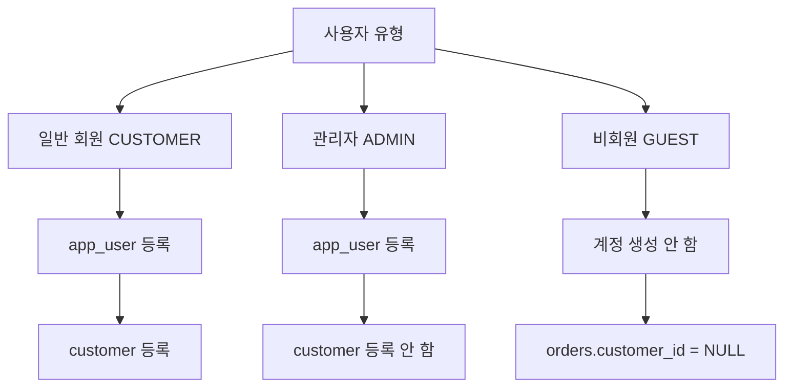
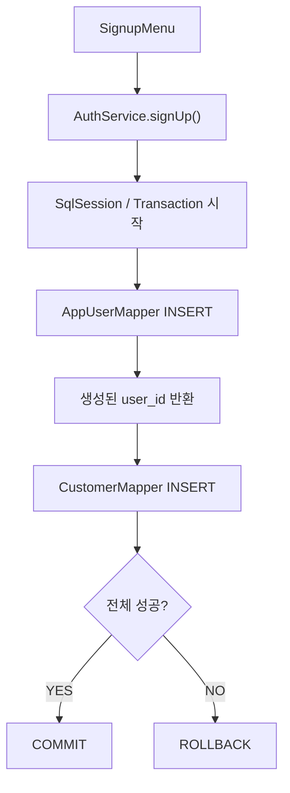

# 👤 터미널마켓 사용자 · 관리자 등록 가이드

> **💡 한 줄 요약**  
> 일반 회원은 **`app_user + customer` 두 테이블에 등록**하고,  
> 관리자는 **`app_user`에만 등록**하면 됩니다.

---

## 🧭 1. 전체 구조 한눈에 보기

터미널마켓의 사용자 계정 구조는 크게 3가지입니다.



| 사용자 유형 | `app_user` | `customer` | 핵심 규칙 |
| :--- | :---: | :---: | :--- |
| **일반 회원** | ✅ | ✅ | `role_code = 'CUSTOMER'` |
| **관리자** | ✅ | ❌ | `role_code = 'ADMIN'` |
| **비회원** | ❌ | ❌ | 주문 시 `customer_id = NULL` |

---

# 🙋 2. 일반 회원 등록하기

일반 회원은 로그인 계정 정보와 회원 프로필 정보가 모두 필요합니다.

따라서 아래 두 테이블에 등록됩니다.

```text
app_user
   ↓
customer
```

## ✅ 복붙용 SQL

```sql
BEGIN;

WITH new_user AS (
    INSERT INTO app_user (
        email,
        password_hash,
        role_code,
        is_active
    )
    VALUES (
        'user01@example.com',
        'HASH_VALUE',
        'CUSTOMER',
        TRUE
    )
    RETURNING user_id
)
INSERT INTO customer (
    user_id,
    customer_name,
    phone
)
SELECT
    user_id,
    '홍길동',
    '01012345678'
FROM new_user;

COMMIT;
```

---

## 🔍 SQL이 하는 일

### 1단계. `app_user`에 로그인 계정 등록

```sql
INSERT INTO app_user (
    email,
    password_hash,
    role_code,
    is_active
)
VALUES (
    'user01@example.com',
    'HASH_VALUE',
    'CUSTOMER',
    TRUE
);
```

등록되는 값은 다음과 같습니다.

| 컬럼 | 예시 |
| :--- | :--- |
| `email` | `user01@example.com` |
| `password_hash` | `HASH_VALUE` |
| `role_code` | `CUSTOMER` |
| `is_active` | `TRUE` |

---

### 2단계. 생성된 `user_id` 받아오기

```sql
RETURNING user_id
```

PostgreSQL이 자동으로 만든 `user_id`를 바로 받아옵니다.

예:

```text
user_id = 5
```

---

### 3단계. `customer`에 회원 프로필 등록

```sql
INSERT INTO customer (
    user_id,
    customer_name,
    phone
)
SELECT
    user_id,
    '홍길동',
    '01012345678'
FROM new_user;
```

결과:

```text
app_user
user_id = 5
email = user01@example.com

        ↓ 연결

customer
user_id = 5
customer_name = 홍길동
phone = 01012345678
```

---

# 🛡️ 3. 관리자 등록하기

관리자는 일반 회원과 다르게 `customer` 프로필이 필요하지 않습니다.

즉:

```text
app_user만 등록
```

하면 됩니다.

## ✅ 복붙용 SQL

```sql
INSERT INTO app_user (
    email,
    password_hash,
    role_code,
    is_active
)
VALUES (
    'admin@example.com',
    'ADMIN_HASH_VALUE',
    'ADMIN',
    TRUE
);
```

---

## 🔍 관리자 등록 결과

```text
app_user
--------------------------------
email         admin@example.com
role_code     ADMIN
is_active     true

customer
--------------------------------
등록하지 않음
```

---

# 🔑 4. 비밀번호는 어떻게 넣어야 하나?

현재 DB 컬럼은 다음과 같습니다.

```text
password_hash
```

즉, 최종 프로젝트에서는 비밀번호 원문을 그대로 저장하지 않는 것을 원칙으로 합니다.

## ❌ 권장하지 않는 방식

```sql
INSERT INTO app_user (
    email,
    password_hash,
    role_code
)
VALUES (
    'user01@example.com',
    'Password123!',
    'CUSTOMER'
);
```

---

## ✅ 실제 프로젝트 흐름


예:

```text
Password123!
        ↓
PasswordHasher
        ↓
$2a$10$xxxxxxxxxxxxxxxx
        ↓
DB 저장
```

---

## 🧪 아직 로그인 기능이 없을 때

초기 DB 테스트만 할 목적이라면 임시 문자열을 넣을 수 있습니다.

```sql
'TEMP_HASH'
```

예:

```sql
INSERT INTO app_user (
    email,
    password_hash,
    role_code,
    is_active
)
VALUES (
    'test@example.com',
    'TEMP_HASH',
    'CUSTOMER',
    TRUE
);
```

> ⚠️ 실제 로그인 구현 후에는 Java의 비밀번호 해시 방식과 맞지 않으면 로그인이 실패할 수 있습니다.

---

# 🔎 5. 등록된 계정 확인하기

## 전체 사용자 확인

```sql
SELECT
    user_id,
    email,
    role_code,
    is_active,
    created_at
FROM app_user
ORDER BY user_id;
```

---

## 회원 프로필까지 한 번에 확인

```sql
SELECT
    u.user_id,
    u.email,
    u.role_code,
    u.is_active,
    c.customer_id,
    c.customer_name,
    c.phone
FROM app_user u
LEFT JOIN customer c
    ON c.user_id = u.user_id
ORDER BY u.user_id;
```

### 정상적으로 보이는 형태

```text
CUSTOMER
→ app_user 있음
→ customer 있음

ADMIN
→ app_user 있음
→ customer는 NULL
```

---

# 📧 6. 이메일 중복 확인하기

`app_user.email`에는 `UNIQUE` 제약이 걸려 있습니다.

같은 이메일을 두 번 넣으면 DB에서 오류가 발생합니다.

## 등록 전 확인 SQL

```sql
SELECT
    user_id,
    email,
    role_code
FROM app_user
WHERE email = 'user01@example.com';
```

### 결과 해석

```text
조회 결과 없음
→ 사용 가능한 이메일

조회 결과 있음
→ 이미 사용 중인 이메일
```

---

## Java에서는 이렇게 처리 예정

```text
회원가입 이메일 입력
        ↓
중복 조회
        ↓
이미 존재?
 ├─ YES → "이미 사용 중인 이메일입니다."
 └─ NO  → 회원가입 진행
```

단, 최종적으로는 DB의 `UNIQUE` 오류도 같이 처리하는 것이 안전합니다.

---

# 🔢 7. user_id가 1이 아니라 5여도 괜찮은 이유

현재 `user_id`는 PostgreSQL의 `IDENTITY`를 사용합니다.

```sql
user_id BIGINT GENERATED ALWAYS AS IDENTITY
```

PostgreSQL은 INSERT를 시도할 때 자동 번호를 발급합니다.

예:

```text
1번 발급 → INSERT 실패
2번 발급 → ROLLBACK
3번 발급 → 테스트 데이터 삭제
4번 발급 → 테스트 데이터 삭제
5번 발급 → 정상 INSERT
```

그러면 DB에 실제 데이터가 한 개뿐이어도:

```text
user_id = 5
```

가 될 수 있습니다.

> **이것은 오류가 아닙니다.**

PK의 목적은:

```text
번호를 1, 2, 3, 4로 예쁘게 맞추는 것 ❌
각 데이터를 유일하게 구분하는 것 ✅
```

입니다.

---

# 🛑 8. Java에서 user_id를 직접 숫자로 쓰지 않기

다음 방식은 피하는 것이 좋습니다.

```java
long adminId = 1L;
```

왜냐하면 실제 관리자 ID가:

```text
5
8
12
```

등이 될 수 있기 때문입니다.

## ✅ 권장 방식

로그인 성공 후 실제 사용자 정보를 세션에 저장합니다.

```text
로그인
  ↓
email로 사용자 조회
  ↓
user_id 획득
  ↓
LoginSession에 저장
  ↓
필요한 기능에서 사용
```

예:

```java
session.GetUserId();
```

---

# 🧹 9. 개발 초기에 ID를 다시 1부터 시작하고 싶다면

아직 테스트 단계이고 관련 데이터를 모두 삭제해도 괜찮을 때만 사용합니다.

```sql
TRUNCATE TABLE app_user
RESTART IDENTITY
CASCADE;
```

이 명령은:

```text
app_user 데이터 삭제
+
IDENTITY 번호 초기화
```

를 수행합니다.

---

## ⚠️ CASCADE 주의

현재 `app_user`는 다른 테이블과 연결되어 있습니다.

```text
app_user
 ├─ customer
 └─ stock_adjustment
```

따라서:

```sql
TRUNCATE TABLE app_user
RESTART IDENTITY
CASCADE;
```

를 실행하면 연결된 데이터까지 영향을 받을 수 있습니다.

> 팀원이 이미 테스트 데이터를 넣은 상태라면 임의로 실행하지 않는 것을 권장합니다.

---

# 📦 10. 관리자 등록 후 재고 조정 테스트하기

`stock_adjustment`에는 다음 FK가 있습니다.

```text
adjusted_by_user_id
        ↓
app_user.user_id
```

따라서 재고 조정을 테스트하려면 관리자 계정이 먼저 존재해야 합니다.

---

## 관리자 확인

```sql
SELECT
    user_id,
    email,
    role_code
FROM app_user
WHERE email = 'admin@example.com'
  AND role_code = 'ADMIN';
```

---

## 관리자 계정으로 재고 조정 이력 INSERT

```sql
INSERT INTO stock_adjustment (
    product_id,
    quantity_delta,
    reason,
    adjusted_by_user_id
)
SELECT
    p.product_id,
    10,
    '추가 입고',
    u.user_id
FROM product p
JOIN app_user u
    ON u.email = 'admin@example.com'
WHERE p.product_code = 'ST001'
  AND u.role_code = 'ADMIN';
```

이렇게 작성하면:

```text
관리자 user_id를 직접 숫자로 입력할 필요 없음
```

이 장점이 있습니다.

---

# ☕ 11. 나중에 Java 회원가입 기능을 만들 때 흐름

회원가입에서는 아래 구조로 구현하면 됩니다.



즉:

```text
SignupMenu
    ↓
AuthService
    ↓
app_user INSERT
    ↓
user_id 받기
    ↓
customer INSERT
    ↓
COMMIT
```

중간에 실패하면:

```text
ROLLBACK
```

합니다.

---

# ⚠️ 12. 초보자가 가장 많이 하는 실수 TOP 5

### 1) 관리자를 `customer`에도 넣음

```text
ADMIN
→ app_user만 등록
```

관리자는 `customer`에 넣지 않습니다.

---

### 2) 일반 회원을 `app_user`에만 넣음

일반 회원은:

```text
app_user
+
customer
```

둘 다 필요합니다.

---

### 3) role_code 오타

정확히 아래 값만 사용합니다.

```sql
'ADMIN'
'CUSTOMER'
```

예를 들어:

```text
'user'
'admin'
'Customer'
```

처럼 사용하면 CHECK 제약에 걸릴 수 있습니다.

---

### 4) user_id를 직접 지정함

이런 식으로 쓰지 않습니다.

```sql
INSERT INTO app_user (
    user_id,
    email,
    password_hash,
    role_code
)
VALUES (
    1,
    'admin@example.com',
    'HASH',
    'ADMIN'
);
```

`user_id`는 PostgreSQL이 자동 생성하도록 둡니다.

---

### 5) 같은 이메일을 다시 등록함

```text
admin@example.com
admin@example.com
```

같은 이메일은 `UNIQUE` 제약 때문에 두 번 등록되지 않습니다.

---

# 📋 13. 최종 치트키

## 🙋 일반 회원

```sql
BEGIN;

WITH new_user AS (
    INSERT INTO app_user (
        email,
        password_hash,
        role_code,
        is_active
    )
    VALUES (
        'user01@example.com',
        'HASH_VALUE',
        'CUSTOMER',
        TRUE
    )
    RETURNING user_id
)
INSERT INTO customer (
    user_id,
    customer_name,
    phone
)
SELECT
    user_id,
    '홍길동',
    '01012345678'
FROM new_user;

COMMIT;
```

---

## 🛡️ 관리자

```sql
INSERT INTO app_user (
    email,
    password_hash,
    role_code,
    is_active
)
VALUES (
    'admin@example.com',
    'ADMIN_HASH_VALUE',
    'ADMIN',
    TRUE
);
```

---

## 🔎 전체 사용자 확인

```sql
SELECT
    user_id,
    email,
    role_code,
    is_active
FROM app_user
ORDER BY user_id;
```

---

## 🔎 회원 프로필까지 확인

```sql
SELECT
    u.user_id,
    u.email,
    u.role_code,
    c.customer_name,
    c.phone
FROM app_user u
LEFT JOIN customer c
    ON c.user_id = u.user_id
ORDER BY u.user_id;
```

---

# ✅ 14. 마지막 정리

```text
일반 회원
→ app_user + customer

관리자
→ app_user만

비회원
→ 계정 없음
→ orders.customer_id = NULL
```

> **기억할 것**  
> `user_id`가 1부터 시작하지 않아도 정상입니다.  
> 코드에서는 ID를 직접 고정하지 말고 DB에서 조회한 실제 값을 사용합니다.
