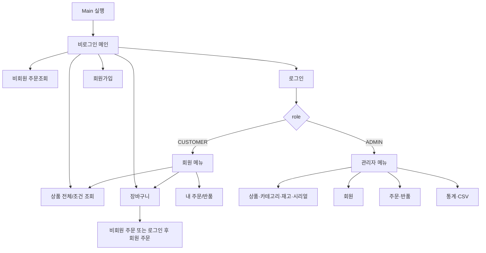

# 터미널마켓 콘솔 메뉴·화면 흐름 v0.3

## 공통 표시 원칙
- 비회원/회원 화면 상단에는 `TERMINAL MARKET`과 `장바구니(n)`을 계속 표시한다.
- n은 장바구니 **총 수량 합계**다.
- 관리자는 구매 역할이 아니므로 장바구니를 표시하지 않는다.

## 1. 최초 실행 / 비로그인 메뉴
```text
========================================
             TERMINAL MARKET
----------------------------------------
장바구니(0)
========================================
1. 상품 전체 조회
2. 상품 조건 조회 (카테고리 / 가격)
3. 장바구니 보기
4. 비회원 주문 조회
5. 로그인
6. 회원가입
0. 종료
----------------------------------------
선택 >
```

상품 화면에서 `장바구니 담기`를 선택할 수 있다. 비회원은 로그인하지 않고도 장바구니에서 바로 구매할 수 있다.

## 2. 회원 메뉴
```text
========================================
             TERMINAL MARKET
[회원] user@example.com
장바구니(3)
========================================
1. 상품 전체 조회
2. 상품 조건 조회 (카테고리 / 가격)
3. 장바구니 보기
4. 내 주문 목록 / 상세
5. 반품
6. 내 정보 조회 / 수정
7. 로그아웃
0. 종료
----------------------------------------
선택 >
```

## 3. 관리자 메뉴
```text
========================================
             TERMINAL MARKET
[관리자] admin@example.com
========================================
1. 상품 / 카테고리 관리
2. 재고 / 시리얼 관리
3. 회원 관리
4. 주문 / 반품 관리
5. 통계
6. CSV 저장 / 불러오기
7. 로그아웃
0. 종료
----------------------------------------
선택 >
```

## 4. 장바구니 예시
```text
[장바구니(3)]
번호  상품명              단가      수량      금액
1     검정 볼펜 0.5mm     1,000       2      2,000
2     퍼즐 500pcs        12,000       1     12,000
--------------------------------------------------
합계                                      14,000원

1. 수량 변경  2. 품목 삭제  3. 전체 비우기  4. 구매  0. 이전
```
같은 상품을 다시 담으면 새 행을 만들지 않고 수량을 합산한다. 따라서 위 장바구니의 카운트는 품목 종류 2개가 아니라 총 수량 3개다.

## 5. 비회원 구매 완료 예시
```text
주문이 완료되었습니다.
주문번호: TM-20260917-A8K3Q7P2

※ 비회원 주문조회에 필요한 번호입니다.
※ 주문번호를 분실하면 이 프로젝트 범위에서는 조회할 수 없습니다.
```

## 6. 화면 전환


## 메뉴 구현 주의
- `MainMenu` 하나에 모든 분기를 몰아넣지 않는다.
- `GuestMenu`, `MemberMenu`, `AdminMenu`를 나눠 역할별 메뉴를 명확히 한다.
- 메뉴를 숨겼더라도 Service에서 role/소유권을 다시 검사한다.
- 로그아웃하거나 다른 사용자로 전환할 때 기존 장바구니를 비운다.
