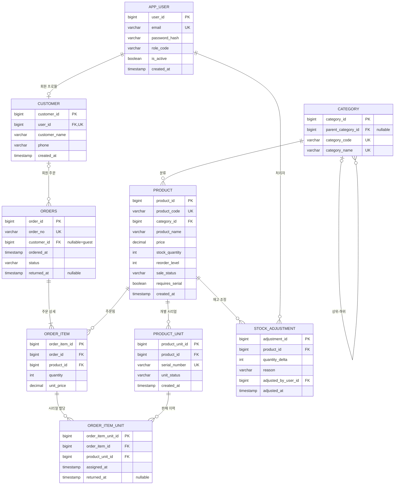

# 터미널마켓 테이블 설계 및 ERD v0.3

## 1. 테이블 구성
총 9개 테이블이다. 장바구니, 반품, 비회원 전용 계정은 별도 테이블을 만들지 않는다. 필요한 독립 개체와 이력만 분리한다.

| 테이블 | 역할 | 분리 이유 |
|---|---|---|
| app_user | 인증/역할 | 관리자와 회원 계정 공통 |
| customer | 회원 프로필 | 관리자 계정에는 고객 프로필이 없으므로 분리 |
| category | 상·하위 카테고리 | self FK로 계층을 한 테이블에서 표현 |
| product | 상품 모델/현재 재고 | 공통 판매 단위 |
| product_unit | 개별 시리얼 실물 | 스마트폰·노트북·명품 등 단품 추적 |
| orders | 주문 머리 | 회원/비회원 주문 공통 |
| order_item | 주문-상품 연결 | orders와 product의 N:M 해소 |
| order_item_unit | 주문품목-실물 연결 | 시리얼 판매/반품 이력 추적 |
| stock_adjustment | 주문 외 재고 이력 | 입고·파손·수동 보정 이력 |

## 2. ERD

## 3. 테이블 상세

### app_user

| 컬럼 | 논리 자료형 | 제약 | 설명 |
|---|---|---|---|
| user_id | BIGINT | PK, NN | 계정 식별자 |
| email | VARCHAR(254) | UQ, NN | 로그인 이메일; 소문자 정규화 |
| password_hash | VARCHAR(255) | NN | 해시만 저장 |
| role_code | VARCHAR(20) | NN | ADMIN/CUSTOMER |
| is_active | BOOLEAN | NN | 기본 true |
| created_at | TIMESTAMP | NN | 가입 시각 |

### customer

| 컬럼 | 논리 자료형 | 제약 | 설명 |
|---|---|---|---|
| customer_id | BIGINT | PK, NN | 회원 프로필 식별자 |
| user_id | BIGINT | FK, UQ, NN | app_user.user_id |
| customer_name | VARCHAR(50) | NN | 이름 |
| phone | VARCHAR(20) | NN | 연락처 |
| created_at | TIMESTAMP | NN | 등록 시각 |

### category

| 컬럼 | 논리 자료형 | 제약 | 설명 |
|---|---|---|---|
| category_id | BIGINT | PK, NN | 분류 식별자 |
| parent_category_id | BIGINT | FK, NULL | 같은 category의 상위 분류 |
| category_code | VARCHAR(20) | UQ, NN | C100, C110 등 |
| category_name | VARCHAR(50) | UQ, NN | 표시명 |

### product

| 컬럼 | 논리 자료형 | 제약 | 설명 |
|---|---|---|---|
| product_id | BIGINT | PK, NN | 상품 모델 식별자 |
| product_code | VARCHAR(30) | UQ, NN | 고유 상품 코드 |
| category_id | BIGINT | FK, NN | 하위 category 참조 |
| product_name | VARCHAR(100) | NN | 상품명 |
| price | DECIMAL(12,0) | NN, >=0 | 현재 가격 |
| stock_quantity | INTEGER | NN, >=0 | 현재 판매 가능 수량 |
| reorder_level | INTEGER | NN, >=0 | 보충 기준 |
| sale_status | VARCHAR(20) | NN | SELLING/STOPPED |
| requires_serial | BOOLEAN | NN | 개별 시리얼 관리 여부 |
| created_at | TIMESTAMP | NN | 등록 시각 |

### product_unit

| 컬럼 | 논리 자료형 | 제약 | 설명 |
|---|---|---|---|
| product_unit_id | BIGINT | PK, NN | 실물 단위 식별자 |
| product_id | BIGINT | FK, NN | product.product_id |
| serial_number | VARCHAR(100) | UQ, NN | 개별 시리얼/정품번호 |
| unit_status | VARCHAR(20) | NN | AVAILABLE/SOLD |
| created_at | TIMESTAMP | NN | 시리얼 등록 시각 |

### orders

| 컬럼 | 논리 자료형 | 제약 | 설명 |
|---|---|---|---|
| order_id | BIGINT | PK, NN | 내부 주문 PK |
| order_no | VARCHAR(30) | UQ, NN | 외부 공개 주문번호 |
| customer_id | BIGINT | FK, NULL | NULL이면 비회원 주문 |
| ordered_at | TIMESTAMP | NN | 주문 시각 |
| status | VARCHAR(20) | NN | CONFIRMED/RETURNED |
| returned_at | TIMESTAMP | NULL | 반품 완료 시각 |

### order_item

| 컬럼 | 논리 자료형 | 제약 | 설명 |
|---|---|---|---|
| order_item_id | BIGINT | PK, NN | 주문 품목 식별자 |
| order_id | BIGINT | FK, NN | orders.order_id |
| product_id | BIGINT | FK, NN | product.product_id |
| quantity | INTEGER | NN, >0 | 주문 수량 |
| unit_price | DECIMAL(12,0) | NN, >=0 | 주문 당시 단가 |
| (order_id, product_id) | - | UQ | 한 주문에 같은 상품 1행 |

### order_item_unit

| 컬럼 | 논리 자료형 | 제약 | 설명 |
|---|---|---|---|
| order_item_unit_id | BIGINT | PK, NN | 시리얼 할당 이력 |
| order_item_id | BIGINT | FK, NN | order_item.order_item_id |
| product_unit_id | BIGINT | FK, NN | 실제 판매 단위 |
| assigned_at | TIMESTAMP | NN | 판매 할당 시각 |
| returned_at | TIMESTAMP | NULL | 해당 단위 반품 시각 |

### stock_adjustment

| 컬럼 | 논리 자료형 | 제약 | 설명 |
|---|---|---|---|
| adjustment_id | BIGINT | PK, NN | 조정 이력 식별자 |
| product_id | BIGINT | FK, NN | 대상 상품 |
| quantity_delta | INTEGER | NN, !=0 | 입고 + / 파손·보정 - |
| reason | VARCHAR(200) | NN | 조정 사유 |
| adjusted_by_user_id | BIGINT | FK, NN | 관리자 app_user |
| adjusted_at | TIMESTAMP | NN | 처리 시각 |

## 4. 관계와 링크드 엔티티
- `orders ↔ product`는 자연스럽게 N:M이다. 이를 `order_item`이 연결한다.
- `order_item ↔ product_unit`도 시리얼 판매 이력을 보존하기 위해 `order_item_unit`으로 연결한다. 반품 후 동일 실물이 다시 판매될 수 있으므로 한 product_unit은 시간상 여러 판매 이력에 참여할 수 있다.
- `category`는 자기 자신을 참조하는 1:N으로 상·하위 분류를 표현한다. 상위/하위 전용 테이블을 별도로 만들지 않는다.

## 5. 왜 더 나누지 않는가
- 장바구니: 프로그램 세션에서만 필요 → 메모리 객체.
- 비회원: 계정/프로필이 필요 없음 → orders.customer_id=NULL.
- 반품: 전체 주문 반품만 필요 → orders.status + returned_at.
- 로그인 잠금/추천인/포인트: 보류 → 아직 컬럼/테이블 추가 안 함.
- 품절: stock_quantity=0으로 계산 → is_sold_out 컬럼 없음.
- 주문 총액: order_item.quantity × unit_price 합계 → total_amount 컬럼 없음.

## 6. 시리얼 관리 규칙
1. `requires_serial=false` 상품은 product_unit 행이 없어도 된다.
2. `requires_serial=true` 상품 입고 시 수량만 올리지 말고 수량만큼 고유 serial_number를 등록한다.
3. 시리얼 상품의 `stock_quantity`는 AVAILABLE product_unit 수와 일치해야 한다.
4. 주문 시 수량만큼 AVAILABLE unit을 SOLD로 바꾸고 order_item_unit 이력을 저장한다.
5. 반품 시 해당 unit을 AVAILABLE로 복구하고 order_item_unit.returned_at을 기록한다.

## 7. 정규화 관점
테이블 수가 많을수록 좋은 것이 아니다. 독립적으로 식별되거나 반복 이력이 발생하는 사실만 분리한다. app_user/customer, product/product_unit, orders/order_item은 서로 다른 결정자와 생명주기를 가져 분리가 필요하다. 반면 장바구니·품절·주문총액은 현재 범위에서 파생값 또는 세션 데이터이므로 테이블로 분리하지 않는다.

`product.stock_quantity`는 조회·조건부 차감을 위한 의도적 현재값 캐시다. 특히 시리얼 관리 상품에서는 AVAILABLE product_unit 수와 같다는 불변조건을 테스트한다.
