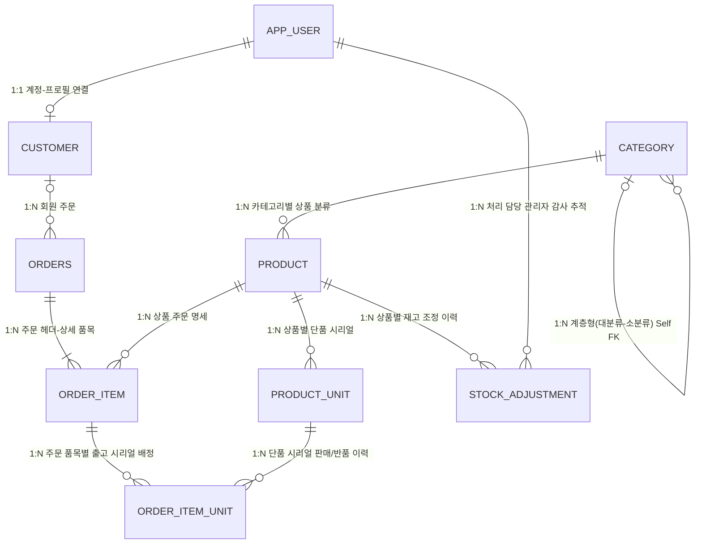

# [산출물 04] TERMINAL MARKET 데이터베이스 테이블설계서 (Database Specification)

---

## 1. 데이터베이스 개요

| 항목 | 내용 |
| :--- | :--- |
| **DBMS** | PostgreSQL 16 |
| **데이터베이스명** | `orderapp` |
| **테이블 수** | 총 9개 테이블 |
| **문자셋 / 인코딩** | UTF-8 |
| **식별자 명명 규칙** | 스네이크 케이스(`snake_case`), 소문자 사용 |
| **기본키(PK) 전략** | `BIGINT GENERATED ALWAYS AS IDENTITY` 또는 `BIGSERIAL` |
| **외래키(FK) 무결성** | 연관 데이터 삭제 시 데이터 고립 방지를 위해 `RESTRICT` 원칙 적용 |

---

## 2. 전체 ERD 및 테이블 연관 관계



```text
[ 9대 테이블 관계 요약 ]
1. app_user (계정) ──── 1:1 ────> customer (회원 프로필)
2. category (카테고리) ── 1:N(Self) ──> category (하위 카테고리)
3. category (카테고리) ── 1:N ───> product (상품 마스터)
4. product (상품) ────── 1:N ───> product_unit (단품 시리얼)
5. orders (주문) ──────── 1:N ───> order_item (주문 품목)
6. product (상품) ────── 1:N ───> order_item (주문 품목)
7. order_item (주문품목) ─ 1:N ───> order_item_unit (시리얼 매핑)
8. product_unit (시리얼) ─ 1:N ───> order_item_unit (시리얼 매핑)
9. product (상품) ────── 1:N ───> stock_adjustment (재고 변경 감사 로그)
```

---

## 3. 테이블별 상세 정의서

### 3.1 `app_user` (사용자 인증 및 권한)
* **설명**: 시스템에 로그인 가능한 모든 계정(회원 및 관리자)의 인증 정보를 보관합니다.

| 컬럼명 | 데이터 타입 | 제약 조건 | 기본값 | 설명 |
| :--- | :--- | :---: | :---: | :--- |
| `user_id` | BIGINT | **PK**, NOT NULL | IDENTITY | 사용자 고유 내부 식별자 |
| `email` | VARCHAR(254) | **UNIQUE**, NOT NULL | - | 로그인용 이메일 주소 (소문자 표준화) |
| `password_hash`| VARCHAR(255) | NOT NULL | - | SHA-256 단방향 솔트 암호화 해시값 |
| `role_code` | VARCHAR(20) | NOT NULL | - | 권한 구분 코드 (`ADMIN`, `CUSTOMER`) |
| `is_active` | BOOLEAN | NOT NULL | `true` | 계정 활성화 상태 여부 |
| `created_at` | TIMESTAMP | NOT NULL | `CURRENT_TIMESTAMP` | 계정 생성 일시 |

---

### 3.2 `customer` (일반 회원 프로필)
* **설명**: 일반 회원의 실명, 연락처 등 비즈니스 프로필을 분리 보관합니다.

| 컬럼명 | 데이터 타입 | 제약 조건 | 기본값 | 설명 |
| :--- | :--- | :---: | :---: | :--- |
| `customer_id` | BIGINT | **PK**, NOT NULL | IDENTITY | 고객 프로필 고유 식별자 |
| `user_id` | BIGINT | **FK**, **UNIQUE**, NOT NULL| - | `app_user(user_id)` 참조 (1:1 매핑) |
| `customer_name`| VARCHAR(50) | NOT NULL | - | 고객 실명 |
| `phone` | VARCHAR(20) | NOT NULL | - | 고객 연락처 (하이픈 포함 표준 포맷) |
| `created_at` | TIMESTAMP | NOT NULL | `CURRENT_TIMESTAMP` | 프로필 등록 일시 |

---

### 3.3 `category` (계층형 상품 카테고리)
* **설명**: 대분류-소분류 등 다단계 카테고리를 자기 참조(Self FK) 구조로 표현합니다.

| 컬럼명 | 데이터 타입 | 제약 조건 | 기본값 | 설명 |
| :--- | :--- | :---: | :---: | :--- |
| `category_id` | BIGINT | **PK**, NOT NULL | IDENTITY | 카테고리 고유 식별자 |
| `parent_category_id`| BIGINT | **FK**, NULL 허용 | `NULL` | `category(category_id)` 자기 참조 (대분류는 NULL) |
| `category_code`| VARCHAR(20) | **UNIQUE**, NOT NULL | - | 카테고리 식별 코드 (예: `C100`, `C110`) |
| `category_name`| VARCHAR(50) | **UNIQUE**, NOT NULL | - | 카테고리 한글 명칭 |

---

### 3.4 `product` (상품 마스터)
* **설명**: 판매 상품의 기본 정보, 가격, 재고 및 시리얼 추적 필요 여부를 관리합니다.

| 컬럼명 | 데이터 타입 | 제약 조건 | 기본값 | 설명 |
| :--- | :--- | :---: | :---: | :--- |
| `product_id` | BIGINT | **PK**, NOT NULL | IDENTITY | 상품 고유 식별자 |
| `product_code` | VARCHAR(30) | **UNIQUE**, NOT NULL | - | 비즈니스 상품 코드 (예: `P-ELEC-001`) |
| `category_id` | BIGINT | **FK**, NOT NULL | - | `category(category_id)` 소속 카테고리 참조 |
| `product_name` | VARCHAR(100) | NOT NULL | - | 상품명 |
| `price` | DECIMAL(12,0)| NOT NULL, `>= 0` | - | 상품 단가 (원화 기준 정수 금액) |
| `stock_quantity`| INTEGER | NOT NULL, `>= 0` | `0` | 현재 가용 재고 수량 |
| `reorder_level` | INTEGER | NOT NULL, `>= 0` | `5` | 안전재고 임계치 (이하일 시 재고부족 경고) |
| `sale_status` | VARCHAR(20) | NOT NULL | `'SELLING'` | 판매 상태 (`SELLING`: 판매중, `STOPPED`: 중지) |
| `requires_serial`| BOOLEAN | NOT NULL | `false` | 단품 고유 시리얼 관리 대상 여부 |
| `created_at` | TIMESTAMP | NOT NULL | `CURRENT_TIMESTAMP` | 상품 등록 일시 |

---

### 3.5 `product_unit` (단품별 고유 시리얼 번호)
* **설명**: `requires_serial = true`인 상품의 실물 개별 단품 고유 번호와 상태를 추적합니다.

| 컬럼명 | 데이터 타입 | 제약 조건 | 기본값 | 설명 |
| :--- | :--- | :---: | :---: | :--- |
| `product_unit_id`| BIGINT | **PK**, NOT NULL | IDENTITY | 단품 시리얼 내부 식별자 |
| `product_id` | BIGINT | **FK**, NOT NULL | - | `product(product_id)` 참조 |
| `serial_number` | VARCHAR(100)| **UNIQUE**, NOT NULL | - | 실물 제품 고유 S/N (예: `SN-MAC-202609-001`) |
| `unit_status` | VARCHAR(20) | NOT NULL | `'AVAILABLE'`| 단품 상태 (`AVAILABLE`: 판매가능, `SOLD`: 출고완료) |
| `created_at` | TIMESTAMP | NOT NULL | `CURRENT_TIMESTAMP` | 시리얼 등록 일시 |

---

### 3.6 `orders` (주문 헤더)
* **설명**: 주문 건당 기본 정보(주문자, 주문번호, 일시, 상태)를 관리하며, 비회원 주문도 수용합니다.

| 컬럼명 | 데이터 타입 | 제약 조건 | 기본값 | 설명 |
| :--- | :--- | :---: | :---: | :--- |
| `order_id` | BIGINT | **PK**, NOT NULL | IDENTITY | 주문 내부 식별자 |
| `order_no` | VARCHAR(30) | **UNIQUE**, NOT NULL | - | 외부 노출용 주문번호 (예: `TM-20260922-A8K3Q7P2`) |
| `customer_id` | BIGINT | **FK**, NULL 허용 | `NULL` | `customer(customer_id)` 참조 (비회원은 NULL) |
| `ordered_at` | TIMESTAMP | NOT NULL | `CURRENT_TIMESTAMP` | 주문 체결 일시 |
| `status` | VARCHAR(20) | NOT NULL | `'CONFIRMED'`| 주문 상태 (`CONFIRMED`: 완료, `RETURNED`: 반품) |
| `returned_at` | TIMESTAMP | NULL 허용 | `NULL` | 반품 처리 완료 일시 |

---

### 3.7 `order_item` (주문 상세 품목)
* **설명**: 하나의 주문에 포함된 상품들과 주문 시점의 판매 단가, 구매 수량을 보관합니다.

| 컬럼명 | 데이터 타입 | 제약 조건 | 기본값 | 설명 |
| :--- | :--- | :---: | :---: | :--- |
| `order_item_id`| BIGINT | **PK**, NOT NULL | IDENTITY | 주문 상세 품목 식별자 |
| `order_id` | BIGINT | **FK**, NOT NULL | - | `orders(order_id)` 참조 |
| `product_id` | BIGINT | **FK**, NOT NULL | - | `product(product_id)` 참조 |
| `quantity` | INTEGER | NOT NULL, `> 0` | - | 구매 수량 |
| `unit_price` | DECIMAL(12,0)| NOT NULL, `>= 0` | - | 주문 당시 결제 단가 (가격 변동 대비 스냅샷) |

---

### 3.8 `order_item_unit` (주문 품목 ↔ 시리얼 출고 매핑 이력)
* **설명**: 어떤 주문 품목에 정확히 어떤 실물 시리얼 번호가 출고되었는지 영구 추적합니다.

| 컬럼명 | 데이터 타입 | 제약 조건 | 기본값 | 설명 |
| :--- | :--- | :---: | :---: | :--- |
| `order_item_unit_id`| BIGINT | **PK**, NOT NULL | IDENTITY | 시리얼 배정 이력 식별자 |
| `order_item_id` | BIGINT | **FK**, NOT NULL | - | `order_item(order_item_id)` 참조 |
| `product_unit_id` | BIGINT | **FK**, NOT NULL | - | `product_unit(product_unit_id)` 참조 |
| `assigned_at` | TIMESTAMP | NOT NULL | `CURRENT_TIMESTAMP` | 시리얼 출고 배정 일시 |
| `returned_at` | TIMESTAMP | NULL 허용 | `NULL` | 반품 환원 일시 |

---

### 3.9 `stock_adjustment` (재고 수량 변경 감사 로그)
* **설명**: 관리자의 모든 재고 입고 및 수량 조정 행위를 '누가, 언제, 왜, 얼마나' 기록합니다.

| 컬럼명 | 데이터 타입 | 제약 조건 | 기본값 | 설명 |
| :--- | :--- | :---: | :---: | :--- |
| `adjustment_id` | BIGINT | **PK**, NOT NULL | IDENTITY | 재고 조정 이력 식별자 |
| `product_id` | BIGINT | **FK**, NOT NULL | - | `product(product_id)` 대상 상품 참조 |
| `quantity_delta` | INTEGER | NOT NULL, `!= 0` | - | 수량 변동폭 (입고: 양수 `+`, 차감/폐기: 음수 `-`) |
| `reason` | VARCHAR(200)| NOT NULL | - | 입출고 및 조정 사유 |
| `adjusted_by_user_id`| BIGINT | **FK**, NOT NULL | - | `app_user(user_id)` 처리 관리자 계정 참조 |
| `adjusted_at` | TIMESTAMP | NOT NULL | `CURRENT_TIMESTAMP` | 재고 조정 처리 일시 |

---

## 4. 데이터 정합성 및 무결성 유지 전략

1. **시리얼 정합성 공식 (Consistency Formula)**:
   $$\text{product.stock\_quantity} = \text{COUNT}(\text{product\_unit WHERE unit\_status = 'AVAILABLE'})$$
   시리얼 추적 대상 상품은 상품 테이블의 재고 수량과 판매 가능 상태의 시리얼 단품 개수가 반드시 1:1로 일치해야 하며, 시스템 내 `SerialStockConsistency` 모듈이 이를 항시 검증합니다.
2. **이력 보존을 위한 스냅샷 전략**:
   * `order_item.unit_price`: 향후 관리자가 상품 마스터(`product.price`)의 가격을 인상/인하하더라도, 과거 체결된 주문의 매출액과 결제 금액이 왜곡되지 않도록 주문 시점의 단가를 스냅샷 형태로 저장합니다.
3. **불필요한 테이블 생성 억제**:
   * 세션 장바구니(`Cart`)는 DB 부하를 줄이기 위해 인메모리로 운영하며 결제 시점에만 DB와 동기화합니다.
   * 비회원 역시 별도의 비회원 테이블을 두지 않고 `orders.customer_id = NULL` 설계를 통해 다형성 있는 유연한 데이터 모델을 완성했습니다.
